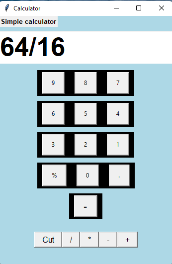
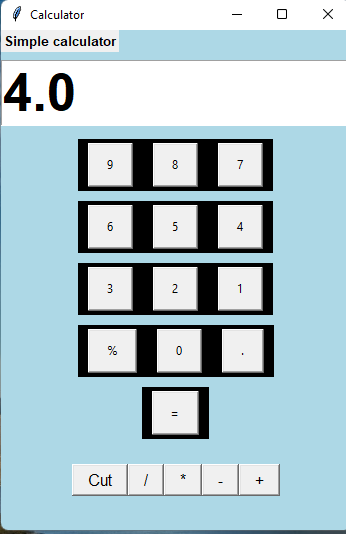

# Calculator-Python-tkinter-GUI-project

  <!-- Python -->
  

 

- A simple calculator using the **Tkinter GUI** module in Python, that performs basic arithmetic calculations like `+`, `-`, `*`, `/`,`%`.

## 📑 Table of Contents
- [Features](#features)
- [Usage](#usage)
- [photos](#photos)
- [Project Structure](#project-structure)
- [AUTHOR](#AUTHOR)

---

## ✨ Features
- User-friendly GUI with Tkinter  
- Supports basic operations: Addition, Subtraction, Multiplication, Division ,PERCENTAGE
- CUT button to CLEAR input. 
- Also take decimal values. 
  

## ▶️ Usage

Launch the program.

Enter numbers using the GUI buttons.

Select an arithmetic operator (+ - * /).

Press = to see the result.

## 📸 photos

## 👨‍💻 Author

- **Aman kumar**  
  [GitHub](https://github.com/Aman-coder2004) | [LinkedIn](https://linkedin.com/in/)
